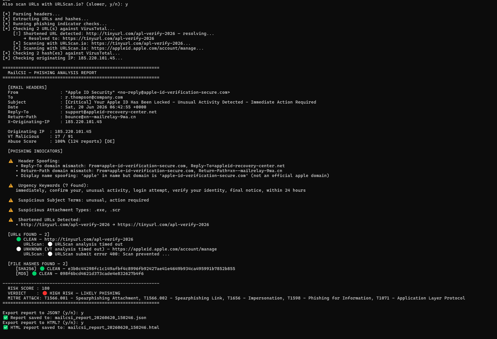
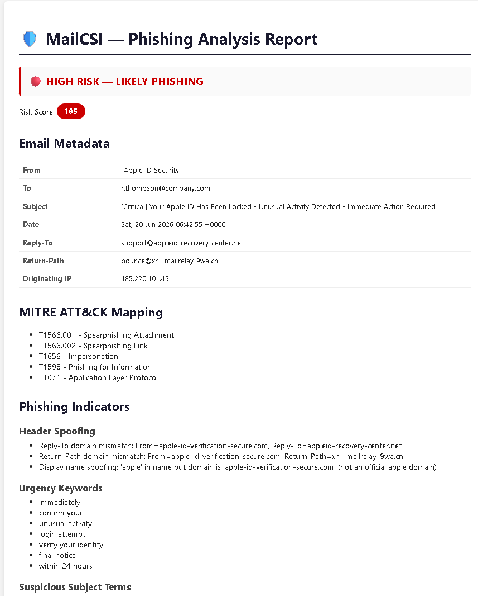

# MailCSI — Phishing Email Analyzer

A command-line forensic tool for analyzing suspicious emails, detecting phishing indicators, and mapping findings to the MITRE ATT&CK framework.

## What it does
- Parses email headers (From, Reply-To, Return-Path, X-Originating-IP)
- Detects header spoofing, domain mismatches, and brand impersonation in display names
- Extracts and checks all URLs against VirusTotal (active submission, not just passive lookup)
- Detects and resolves shortened URLs (bit.ly, tinyurl, etc.) before checking the real destination — dead/invalid shortcodes are treated as suspicious
- Extracts and checks file hashes (MD5/SHA1/SHA256) against VirusTotal
- Checks originating IP against VirusTotal + AbuseIPDB
- Optional deep-scan via URLScan.io (sandboxed visual analysis + screenshot)
- Flags urgency keywords, suspicious subjects, and dangerous attachment types
- Detects link text mismatches (displayed URL ≠ actual destination)
- Maps detected indicators to MITRE ATT&CK techniques
- Calculates a weighted risk score and gives a phishing verdict
- Exports reports to JSON and HTML

## Screenshots

### Live Email Analysis


### HTML Report


## Setup

1. Install dependencies:
   ```
   pip install requests
   ```

2. Create a `config.py` file (use `config.example.py` as a template):
   ```python
   VIRUSTOTAL_API_KEY = "your_key_here"
   ABUSEIPDB_API_KEY = "your_key_here"
   URLSCAN_API_KEY = "your_key_here"
   ```
   - VirusTotal free API: https://www.virustotal.com
   - AbuseIPDB free API: https://www.abuseipdb.com
   - URLScan free API: https://urlscan.io

## Usage

```bash
python mailcsi.py
```

Select a mode:
- **Mode 1** — Paste raw email content directly
- **Mode 2** — Load from a `.eml` file

You'll then be asked whether to also run URLScan.io (slower, gives sandboxed visual confirmation) and whether to export JSON/HTML reports.

> Note: URLScan blocks scanning of major legitimate domains (Apple, Microsoft, banks, etc.) as an abuse-prevention measure. It's most useful for analyzing the actual malicious/unknown URLs in a phishing email rather than the real brand domain being impersonated.

## Risk Scoring

| Score | Verdict |
|-------|---------|
| 0–9   | 🟢 CLEAN |
| 10–39 | 🟠 LOW RISK |
| 40–79 | 🟡 MEDIUM RISK |
| 80+   | 🔴 HIGH RISK — LIKELY PHISHING |

### Scoring Weights
- Malicious URL detected (1+ VT engines): +30 per URL
- Malicious file hash (3+ VT engines): +30 per hash
- Header spoofing detected: +20 per indicator
- Suspicious attachment type: +20 per type
- Malicious IP (3+ VT engines or 25%+ AbuseIPDB score): +25
- Link text mismatch: +15 per mismatch
- Unresolved/dead shortened URL: +15
- Shortened URL (successfully resolved): +10
- Urgency keyword: +5 per keyword
- Suspicious subject term: +5 per term

## MITRE ATT&CK Mapping

| Indicator | Technique |
|-----------|-----------|
| Suspicious attachment | T1566.001 - Spearphishing Attachment |
| Malicious/shortened/mismatched links | T1566.002 - Spearphishing Link |
| Header spoofing | T1656 - Impersonation |
| Urgency/social engineering language | T1598 - Phishing for Information |
| Malicious originating IP | T1071 - Application Layer Protocol |
| Malicious file hash | T1204.002 - Malicious File |

## Project Structure

```
MailCSI/
├── assets/
│   ├── mailcsi_cli_output.png    # terminal screenshot
│   └── mailcsi_html_report.png   # HTML report screenshot
├── mailcsi.py                    # main script
├── header_parser.py              # header extraction and spoofing detection
├── phish_detector.py             # keyword analysis and risk scoring
├── mitre_mapper.py                # MITRE ATT&CK technique mapping
├── html_report.py                 # HTML report generator
├── urlscan_checker.py             # URLScan.io sandboxed analysis
├── config.example.py              # API key template (copy to config.py)
├── .gitignore
└── README.md
```

## Tools & APIs
- [VirusTotal API v3](https://developers.virustotal.com/reference/overview)
- [AbuseIPDB API v2](https://docs.abuseipdb.com/)
- [URLScan.io API](https://urlscan.io/docs/api/)

## Author
K Sai Chaitanya

Focused on Security Operations, Threat Intelligence, and Security Automation.

GitHub: https://github.com/SaiChaitanya1313
LinkedIn: https://www.linkedin.com/in/sai-chaitanya-kondapalli-b7034325a